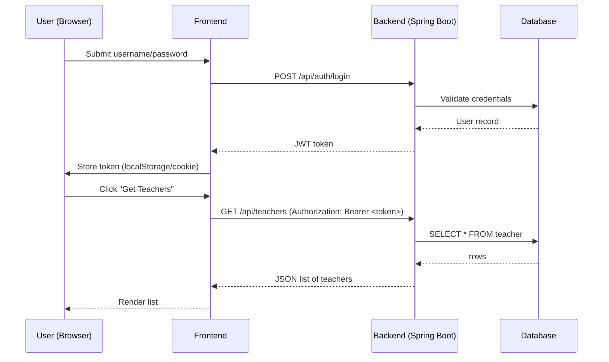

# Employee Management — React + Spring Boot Fullstack

[](https://github.com/)
[](https://adoptopenjdk.net/)
[](https://spring.io/projects/spring-boot)
[](#frontend--basics-configuration--setup)


A simple employee management fullstack application with a React (Vite) frontend and Spring Boot backend. Provides CRUD for employees, an animated dark-themed UI, and responsive layout.

---

## Table of contents

- Project overview
- Quick start (backend)
- Backend (Spring Boot) — explanation and examples
  - Project structure (what each folder is for)
  - JPA, Hibernate, Entities, Repositories, Services, Controllers
  - Transactions, DTOs, and mapping
  - Configuration (application.properties / application.yml)
  - File handling & static assets
  - Security high-level
  - Building & testing
- Frontend (basics & setup)
  - Project layout and API client
  - Environment variables, CORS and dev-proxy
  - Serving frontend from backend
- Visuals & graphics Explaining project
- Summary

---

## Project overview (teacher-style)

Think of the system as three layers:
- Client (browser or mobile) — the UI built in a frontend framework (React/Vue/Angular).
- Backend (Spring Boot) — exposes REST/GraphQL APIs, enforces business rules, persists data to a database.
- Storage (RDBMS and optionally object storage like S3) — holds your structured and binary data.

The backend is organized so responsibilities are clear: controllers for HTTP, services for business logic, repositories for persistence, and entities/dtos for data shapes.

## Key features
- List, add, edit, delete employees
- Dark UI theme with responsive layout
- Animated home/dashboard
- REST API powered by Spring Boot
  
---

## Quick start (backend)

Prerequisites:
- Java 11+ (or whichever version the project targets)
- Maven or Gradle wrapper in the repo
- An IDE (IntelliJ recommended)
- Database: Postgres / MySQL (H2 for local dev)
- (Optional) Docker for running DB locally with containers

Common commands:
- Run in dev: ./mvnw spring-boot:run or ./gradlew bootRun
- Build: ./mvnw clean package && java -jar target/your-app.jar
- Tests: ./mvnw test

---

## Backend (Spring Boot) — explanation and examples

### Project file structure (and why it matters)
A conventional layout makes code easier to find and reason about:

src/
  main/
    java/
      com/yourcompany/yourapp/
        YourAppApplication.java    # Spring Boot main
        config/                    # CORS, Security, Beans, global exception handlers
        controller/                # REST controllers — handle HTTP layer
        service/                   # Business logic & transactions (service layer)
        repository/                # Spring Data JPA interfaces — data access layer
        entity/ / model/           # JPA entities — persistence model
        dto/                       # DTOs for requests/responses (API model)
        mapper/                     # mappers (MapStruct or manual conversion)
        exception/                 # custom exceptions & @ControllerAdvice handlers
        util/                      # utilities and helpers
    resources/
      application.properties or application.yml
      static/                      # static assets if serving frontend from backend
      templates/                   # Thymeleaf or server templates (if used)

Why this separation?
- Controller: thin layer — validate + call service
- Service: orchestrates business rules, transaction boundary
- Repository: interacts with DB (JpaRepository gives CRUD by default)
- DTO/Mapper: prevents exposing internal entities and controls JSON shape

### JPA & Hibernate — concepts with examples

JPA (Java Persistence API) defines standard annotations and an EntityManager API. Hibernate is the most common implementation that executes SQL, caching, flushing, etc.

Entity example:
```java
@Entity
@Table(name = "teachers")
public class Teacher {
    @Id
    @GeneratedValue(strategy = GenerationType.IDENTITY)
    private Long id;

    @Column(nullable = false)
    private String name;

    @OneToMany(mappedBy = "teacher", fetch = FetchType.LAZY, cascade = CascadeType.ALL)
    private List<Course> courses = new ArrayList<>();

    // constructors, getters, setters
}
```

Repository example:
```java
public interface TeacherRepository extends JpaRepository<Teacher, Long> {
    List<Teacher> findByNameContainingIgnoreCase(String name);
}
```

Service + Transactions example:
```java
@Service
public class TeacherService {
    private final TeacherRepository repo;

    public TeacherService(TeacherRepository repo) {
        this.repo = repo;
    }

    @Transactional // transaction boundary here
    public Teacher createTeacher(Teacher t) {
        return repo.save(t);
    }
}
```

Controller example (REST):
```java
@RestController
@RequestMapping("/api/teachers")
public class TeacherController {
    private final TeacherService svc;

    public TeacherController(TeacherService svc) { this.svc = svc; }

    @GetMapping
    public List<TeacherDto> list() {
        return svc.findAll().stream().map(TeacherMapper::toDto).collect(Collectors.toList());
    }

    @PostMapping
    public ResponseEntity<TeacherDto> create(@Valid @RequestBody CreateTeacherRequest req) {
        Teacher created = svc.createTeacher(TeacherMapper.fromCreateRequest(req));
        return ResponseEntity.status(HttpStatus.CREATED).body(TeacherMapper.toDto(created));
    }
}
```

Notes:
- Prefer constructor injection (final fields).
- Keep @Transactional on service layer, not controller.
- Use FetchType.LAZY for collections to avoid N+1; fetch eagerly only when necessary.
- Use DTOs to decouple DB model from API.

### DTOs and mapping
Why DTOs?
- Avoid exposing internal entity structure and relationships.
- Control JSON shape and validation.
- Reduce accidental updates of fields you don't intend to expose.

Use MapStruct for compile-time mappers or manually map in service/mapper classes.

### application.properties / application.yml (example)

application.properties:
```properties
spring.datasource.url=jdbc:postgresql://localhost:5432/mydb
spring.datasource.username=postgres
spring.datasource.password=secret

spring.jpa.hibernate.ddl-auto=update
spring.jpa.show-sql=true
spring.jpa.properties.hibernate.format_sql=true

# For production, use validate and proper migrations (Flyway or Liquibase)
```

Important: do NOT rely on ddl-auto=update in production — use migration tools (Flyway/Liquibase).

### File uploads & static serving
- Serve static files from src/main/resources/static/ (available at /).
- Upload pattern:
  - Accept MultipartFile in controller
  - Validate and store file on disk or upload to S3
  - Store metadata (filename, path, checksum, owner) in DB
- Example:
```java
@PostMapping("/upload")
public ResponseEntity<FileMetadata> upload(@RequestParam("file") MultipartFile file) { ... }
```

### Security (brief)
- Use Spring Security with JWT for stateless APIs.
- Typical flow: /auth/login -> backend returns JWT -> client stores token -> subsequent requests include Authorization: Bearer <token>.
- Protect endpoints with antMatchers or method-level @PreAuthorize.

### Testing
- Unit tests: JUnit + Mockito for services
- Integration tests: @SpringBootTest, use Testcontainers or in-memory DB (H2) for reliable test runs

---

## Frontend — basics, configuration & setup

You can use any modern front-end framework; the guidance below uses React as an example.

Typical layout:
```
frontend/
  public/
  src/
    index.js
    App.js
    pages/
    components/
    services/     # API clients (axios)
    hooks/
    utils/
  package.json
  .env
```

API client example (axios):
```js
// src/services/api.js
import axios from 'axios';

const api = axios.create({
  baseURL: process.env.REACT_APP_API_URL || 'http://localhost:8080/api',
  headers: { 'Content-Type': 'application/json' },
});

api.interceptors.request.use(config => {
  const token = localStorage.getItem('token')
  if (token) config.headers.Authorization = `Bearer ${token}`
  return config
});

export default api;
```

Environment variables:
- Use .env.development and .env.production
- In Create React App, prefix env vars with REACT_APP_
```
REACT_APP_API_URL=http://localhost:8080/api
```

CORS:
- For dev, either enable CORS on backend using @CrossOrigin or configure a dev proxy.
- CRA proxy: add "proxy": "http://localhost:8080" to package.json to forward unknown requests during dev.

Serve frontend from backend:
- Build frontend: npm run build
- Copy build/ into src/main/resources/static/ or deploy separately (CDN preferred for production).

---

## Visuals & graphics

```
flowchart LR
  Client[Client (Browser / Mobile)]
  Frontend[Frontend App (React/Vue/Angular)]
  Backend[Spring Boot API]
  DB[(Postgres / MySQL / H2)]
  Storage[(S3 or Filesystem)]
  Client --> Frontend
  Frontend -->|HTTP / REST / GraphQL| Backend
  Backend -->|JDBC / JPA| DB
```

Sequence example (Mermaid):


s/images/sequence.png`

---


## Example small end-to-end summary

1. Frontend sends POST /api/auth/login with credentials.
2. Backend controller receives request, delegates to AuthService.
3. AuthService uses UserRepository (JpaRepository) to load user, verifies password.
4. If valid, backend generates JWT and returns it.
5. Frontend stores token and includes it in Authorization header for subsequent API calls.
6. Backend endpoints are protected with Spring Security; Service layer methods are transactional and use repositories to persist/read entities.

---
